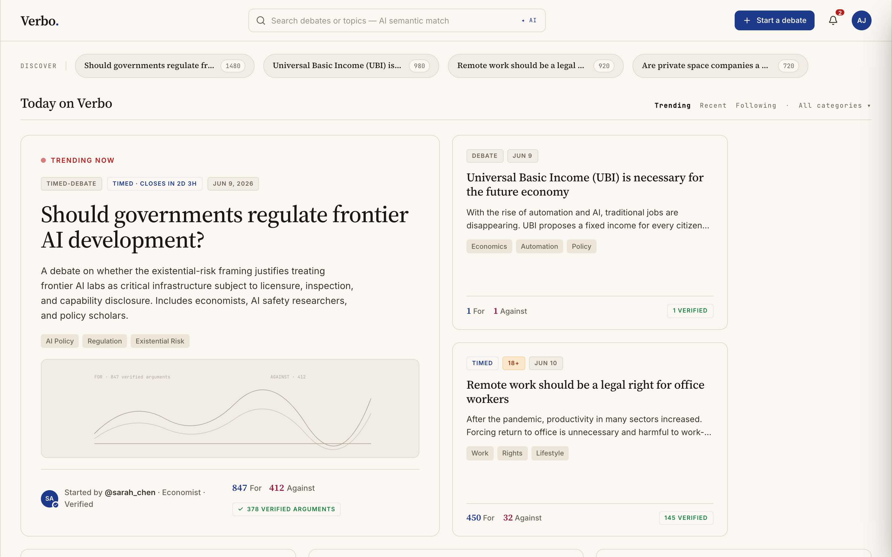
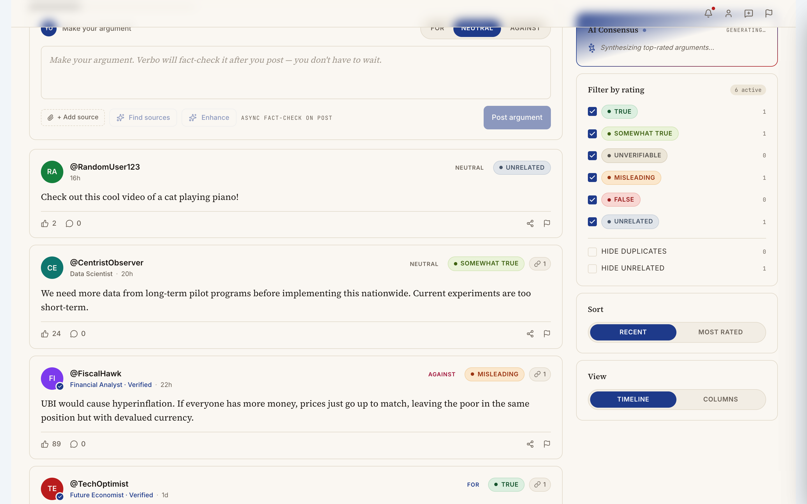
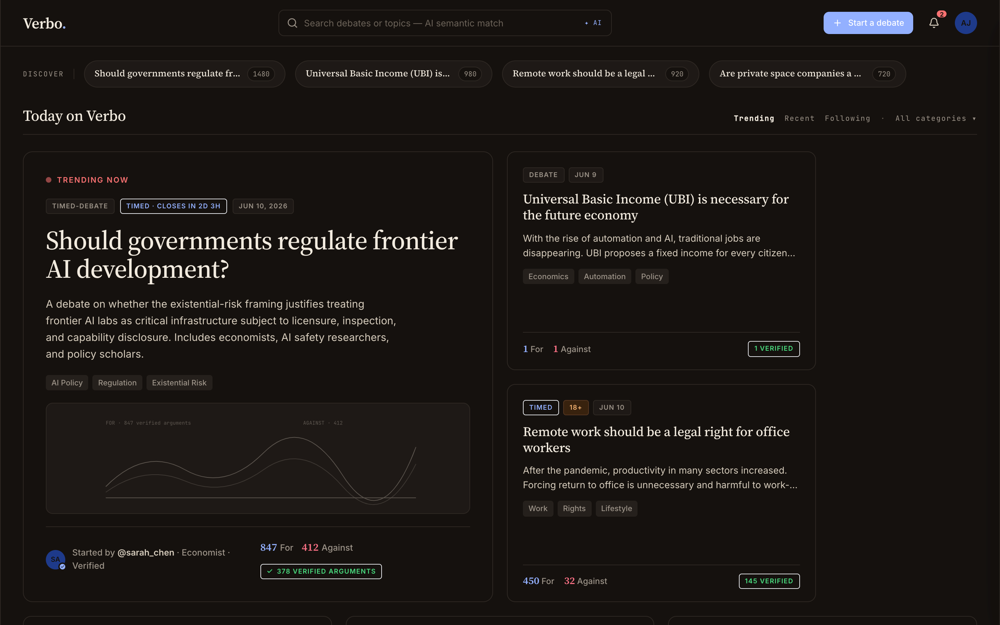

# Verbo

**A debate platform where every argument gets fact-checked.**

Verbo lets people discover debate topics, argue FOR or AGAINST with cited sources, and get AI-powered fact-checking grounded in live web search. Post an argument and keep talking — a reasoning model verifies it in the background and the rating pill (True / Somewhat True / Misleading / False / Unverifiable / Unrelated) appears when it's done.





<details>
<summary>Dark mode</summary>



</details>

## Project status

Verbo was built as a learning MVP and is open-sourced as-is. It is **not actively maintained** — issues and PRs are welcome but responses may be slow. Fork freely.

## Features

- **Async AI fact-checking** — arguments post instantly; a reasoning model with web search verifies them in the background and attaches a rating, reasoning, and grounding sources
- **Stance detection** — the AI flags when your argument's content doesn't match your declared FOR/AGAINST stance
- **Research libraries** — AI-generated FOR / NEUTRAL / AGAINST source collections per topic, with synthesis of where sources agree, disagree, and what's underexplored
- **AI consensus summaries** — distills the top verified arguments on each side
- **Semantic search** — find debates by meaning, not keywords; duplicate detection when creating topics
- **Voice input** — dictate arguments, transcribed via Whisper
- **Argument enhancement** — optional AI rewrite for clarity before posting
- Timed debates, participant management, magazine-style home feed, light/dark themes

## Architecture

```
┌────────────────────┐       POST /api/*       ┌────────────────────┐      ┌────────────────┐
│  React client      │ ──────────────────────► │  verbo-backend     │ ───► │  OpenAI API    │
│  (Vite, Tailwind)  │ ◄────────────────────── │  (Hono proxy)      │      │  + web_search  │
└────────────────────┘                         └────────────────────┘      └────────────────┘
```

- **Frontend** (`/`): React 19 + Vite + Tailwind. Ships with rich mock data and keeps all state in memory — there's no database; this is a product prototype, not a hosted service.
- **Backend** (`server/`): a thin [Hono](https://hono.dev) proxy that holds the OpenAI API key, fronts the [Responses API](https://platform.openai.com/docs/api-reference/responses) (with `web_search` for grounded fact-checking) and Whisper, and enforces an origin allowlist + per-IP rate limiting. See [server/README.md](server/README.md).

Fact-checking is async by design: the UI never blocks on the model. If the backend isn't running, the app still works — AI features degrade gracefully and a banner tells you why.

## Quick start

**Prerequisites:** Node.js 20+

### Frontend only (no API key needed)

```bash
npm install
npm run dev
```

Open http://localhost:3000. You can browse, search, create debates, and post arguments against the mock data. AI features (fact-checking, research, semantic search) stay off and the app shows an "AI features are offline" banner.

### Full setup (AI features on)

In one terminal, start the backend with your OpenAI API key:

```bash
cd server
npm install
cp .env.example .env.local    # then put your OpenAI API key in .env.local
npm run dev                   # listens on :8787
```

In a second terminal, start the client:

```bash
npm install
cp .env.example .env.local    # defaults already point at localhost:8787
npm run dev
```

### Environment variables

| Variable | Where | Purpose |
|---|---|---|
| `VITE_PROXY_URL` | `.env.local` (root) | Backend URL the client calls. Default `http://localhost:8787` |
| `OPENAI_API_KEY` | `server/.env.local` | Your OpenAI key — never exposed to the browser |
| `ALLOWED_ORIGINS` | `server/.env.local` | Comma-separated origins allowed to call the API |
| `PORT` | `server/.env.local` | Backend port (default `8787`) |

## API

The backend exposes `GET /health` plus nine JSON `POST /api/*` endpoints (verify, suggest-sources, consensus, tags, enhance, research, research-synthesis, transcribe, debate-search). The full table, security notes, and Fly.io deployment guide live in [server/README.md](server/README.md).

> **Before deploying publicly:** the proxy has no client authentication — read the [Security section](server/README.md#security) first and set a spending limit on your OpenAI account.

## License

[MIT](LICENSE)
